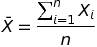
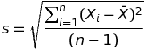
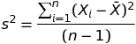
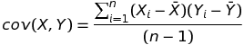
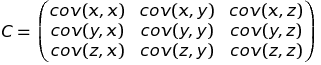

Statistics
==========================

Go package that provides some statistical functions.

- Mean
 - 
- Standard Deviation
 - 
- Variance
 - 
- Covariance
 - 
- Covariance Matrix
 - Example covariance matrix 3x3:
 - 
